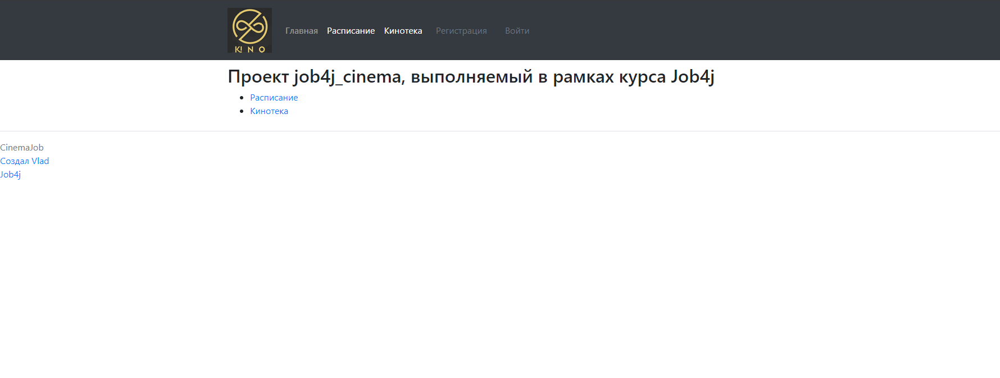
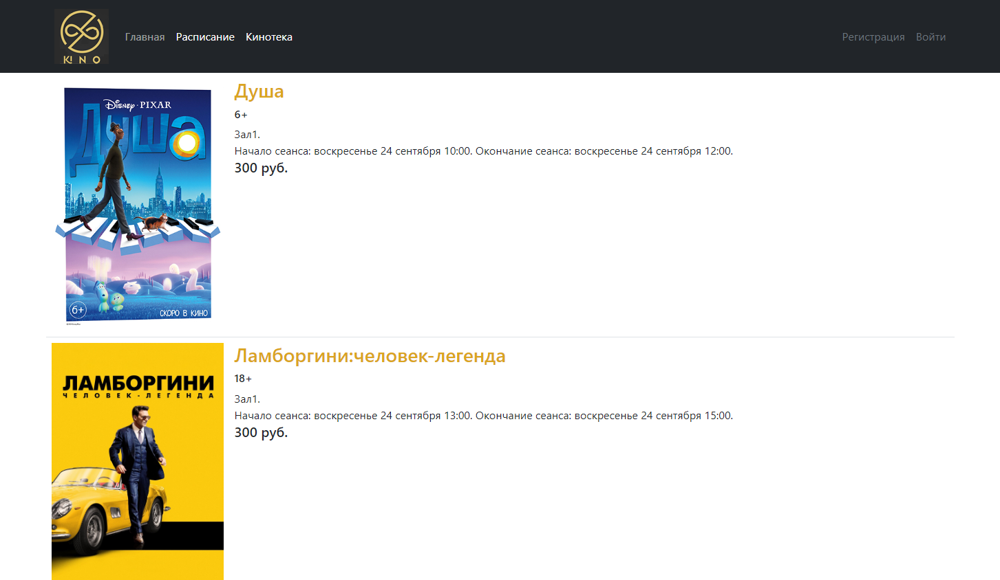
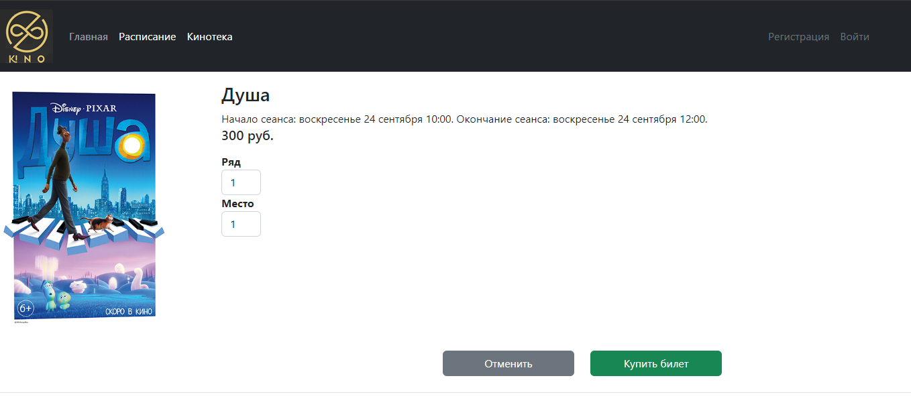
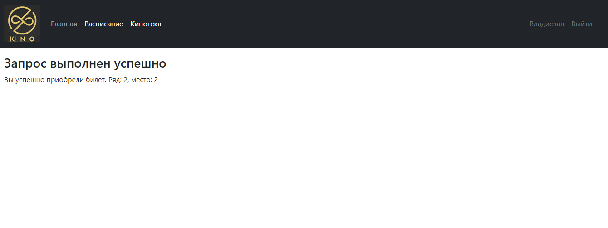
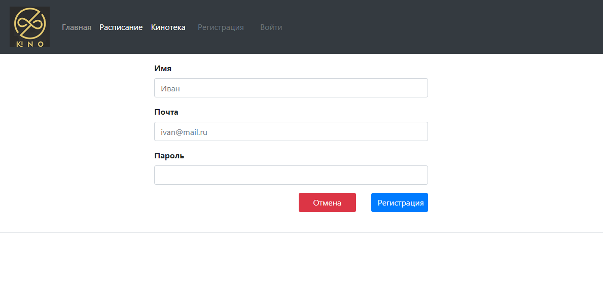
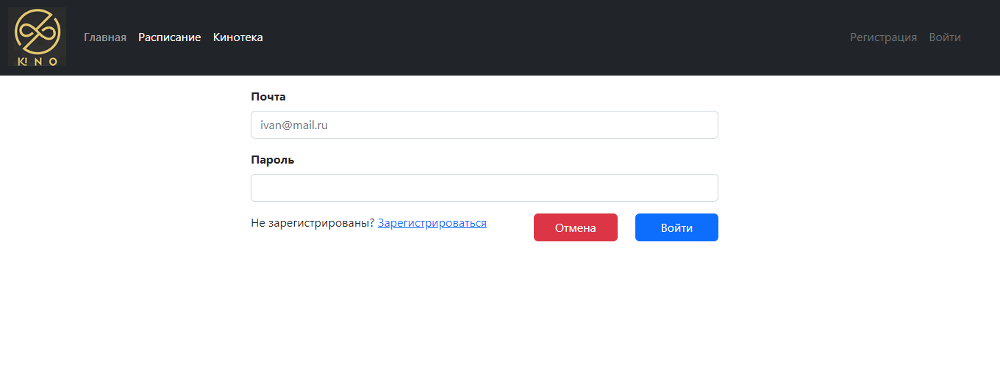

# 
## Проект "Кинотеатр" job4j_cinema :clapper::

В данном проекте реализовано WEB-приложение по покупке билетов в кинотеатр, имеющее следующие возможности:
1. Вывод киносеансов и фильмов;
2. Фильтрацию зарегистрированных/незарегистрированных пользователей;
3. Возможность покупки билетов для зарегистрированных пользователей;

### Стек технологий  :atom::
Java 17
Spring Boot 2.7.6
Thymeleaf
Bootstrap CSS
Liquibase 4.15.0
Sql2o 1.6.0
PostgreSQL 15.1 (драйвер JDBC 42.5.1)
checkstyle 10.0.

### Требования к окружению  :globe_with_meridians::
- Java 17
- Maven 3.8
- PostgreSQL 15.

Как запустить проект :rocket::

Скачать и открыть проект job4j_cinema в IntelliJ Idea;

С помощью pgAdmin4 создать БД "cinema";

Cоздать и заполнить таблицы БД  "cinema";

Открыть закладки Maven и выполнить -> plugins -> liquibase -> liquibase:update;

Запустить точку входа в приложение - класс Main (ru/job4j/cinema/Main.java);

После в браузере открыть путь главной страницы WEB-приложения http://localhost:8080/ :cinema:;

###Главная страница WEB-приложения

###Страница с расписанием фильмов

###Страница покупки билета

###Ошибка при покупке билета

###Страница с сообщением об успешной покупке билета

###Страница регистрации для возможности покупки билета

###Страница входа для зарегистрированных пользователей

Developted by Java-programmer :coffee::

:pen:Ridun Vladislav Valerievich 

:calling:+79021218807 telegram, whatsapp

:mailbox:ridunvv@gmail.com.